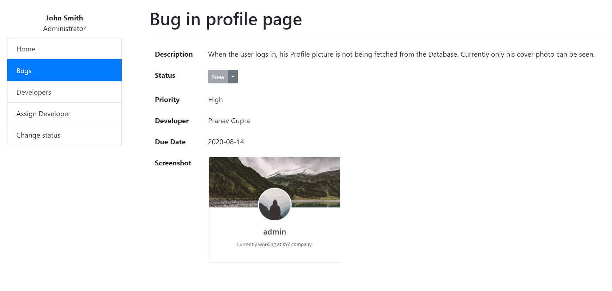

# BugTracker

This is a responsive Bug Tracking WebApp made using AngularJS, and Google Cloud Firestore, which allows users to add, update and assign bugs to developers. All that is being synced with the database in real time. a reponsive Bug Tracking WebApp made using AngularJS for Frontend and Google Firebase as Backend.

### Functionalities
* Users can report new Bugs(can also add screenshot and urgency status)
* Create new Developers
* Assign Developers to Bugs
* Assign Priorities to Bugs
* All data is synced with the database in real-time. 

### Screenshots

## Development server

Run `ng serve` for a dev server. Navigate to `http://localhost:4200/`. The app will automatically reload if you change any of the source files.

## Code scaffolding

Run `ng generate component component-name` to generate a new component. You can also use `ng generate directive|pipe|service|class|guard|interface|enum|module`.

## Build

Run `ng build` to build the project. The build artifacts will be stored in the `dist/` directory. Use the `--prod` flag for a production build.

## Running unit tests

Run `ng test` to execute the unit tests via [Karma](https://karma-runner.github.io).

## Running end-to-end tests

Run `ng e2e` to execute the end-to-end tests via [Protractor](http://www.protractortest.org/).

## Further help

To get more help on the Angular CLI use `ng help` or go check out the [Angular CLI README](https://github.com/angular/angular-cli/blob/master/README.md).
